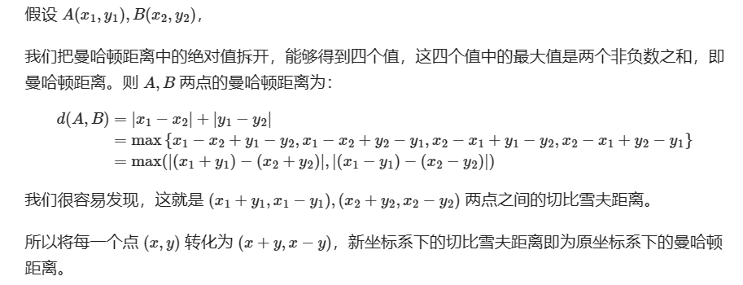
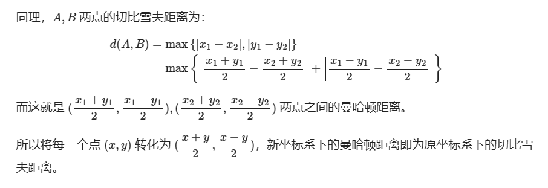

---
https://oi-wiki.org/geometry/distance/
---

# 欧氏距离

# 曼哈顿距离
>（Manhattan distance）
> 
> d = |x1 - x2| + |y1 - y2|
> 
> 从点 i 到点 j 的直接距离不大于途径任何其他点 k 的距离：d(i, j) <= d(i, k) + d(k, j)

# 切比雪夫距离 
> d = max(|x1 - x2|, |y1 - y2|)

# 闵可夫斯基距离

# 汉明距离

